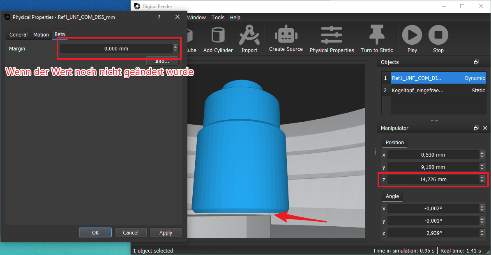
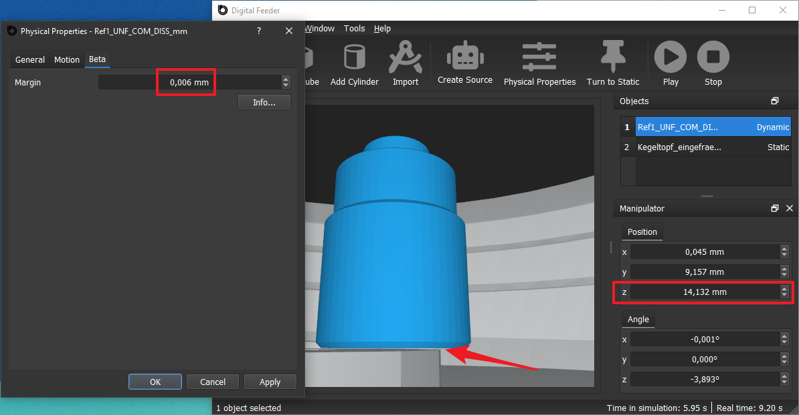
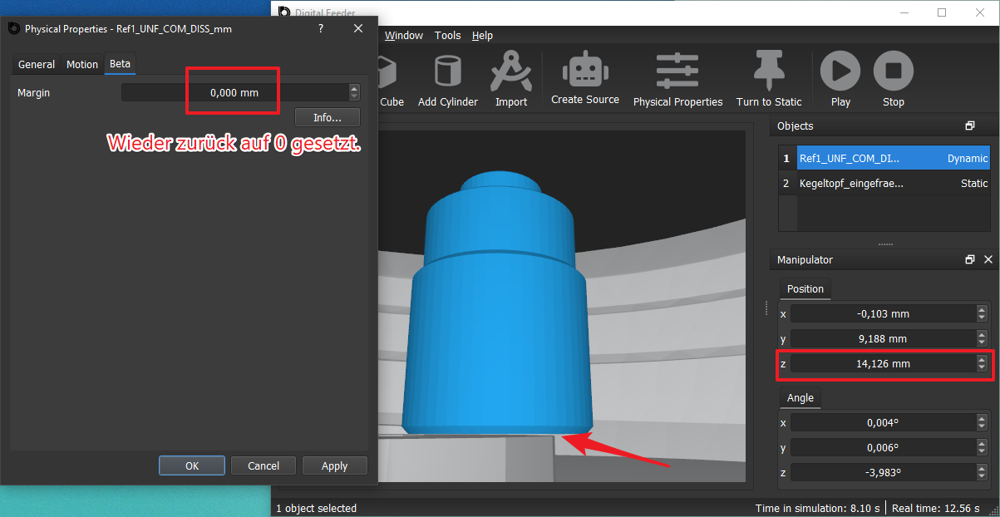

# Margin

In diesem Release kann der Margin-Wert von Custom-Object eingestellt werden.
Die Einheit der Margin auf der *Physical Properties* Dialogmaske ist bereits auf **Millimeter** skaliert.

### Achtung

Wenn die Margin von einem Custom-Object noch nie geändert wurde, wird der Margin-Wert als `0 mm` angezeigt, weil der **Anfangswert** der Margin nicht direkt genommen werden kann. (Nach dem Test schätze ich, dass dieser Anfangswert `0,1 mm` beträgt.) Nachdem die Margin geändert wurde, wird dieser Wert auf der Maske richtig angezeigt.

## Beispiel

## Erklärung der Margin

In der Bullet-Einleitung [Bullet User Manual](https://github.com/bulletphysics/bullet3/blob/master/docs/Bullet_User_Manual.pdf) wird die Margin wie folgt erläutert:

> Bullet uses a small collision margin for collision shapes, to improve performance and reliability of the collision detection. It is best **not to modify the default collision margin**, and if you do use a positive value: zero margin might introduce problems. By default this collision margin is set to **0.04** [①](#myfootnote1), which is 4 centimeter if your units are in meters (recommended). Dependent on which collision shapes, the margin has different meaning. Generally the collision margin will expand the object. This will create a small gap. To compensate for this, some shapes will subtract the margin from the actual size. For **convex hulls, cylinders and cones**, the margin is added to the extents of the object, so a **gap will occur**, unless you adjust the graphics mesh or collision size.

und 

> **Don’t set the collision margin to zero**
> 
> Collision detection system needs some margin for performance and stability.

Die Quelldatei `btCollisionMargin.h` enthält jedoch die folgende Erklärung: 

> Note that when creating small objects, you need to make sure to set a smaller collision margin.

Daher können wir in der Zukunft in den Source-Codes den Margin-Wert basierend auf der Größe eines Bauteils dynamisch festlegen.

---

<a name="myfootnote1">①</a>: Dieser Standardwert `0,04` gilt vermutlich nur für die bullet-Klasse `btConvexInternalShape`, die bei *Digital Feeder* nicht verwendet wird.