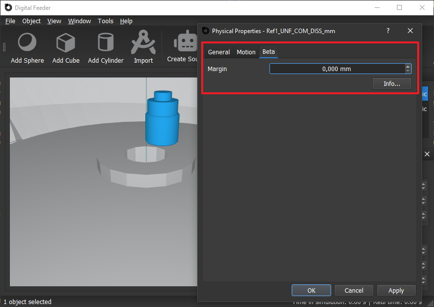

# Margin

In diesem Release kann der Margin-Wert von Custom-Object eingestellt werden.
Die Einheit der Margin auf der *Physical Properties* Dialogmaske ist bereits auf **Millimeter** skaliert.

### Achtung

Wenn die Margin von einem Custom-Object noch nie geändert wurde, wird der Margin-Wert als `0` angezeigt, weil der Anfangswert der Margin kann nicht per der Methode `getMargin()` zugereifen werden. 

## Erklärung der Margin

In der Bullet-Einleitung [Bullet User Manual](https://github.com/bulletphysics/bullet3/blob/master/docs/Bullet_User_Manual.pdf) wird die Margin wie folgt erläutert:

> Bullet uses a small collision margin for collision shapes, to improve performance and reliability of the collision detection. It is best **not to modify the default collision margin**, and if you do use a positive value: zero margin might introduce problems. By default this collision margin is set to **0.04**, which is 4 centimeter if your units are in meters (recommended). Dependent on which collision shapes, the margin has different meaning. Generally the collision margin will expand the object. This will create a small gap. To compensate for this, some shapes will subtract the margin from the actual size. For example, the btBoxShape subtracts the collision margin from the half extents. For a btSphereShape, the entire radius is collision margin so no gap will occur. Don’t override the collision margin for spheres. For **convex hulls, cylinders and cones**, the margin is added to the extents of the object, so a **gap will occur**, unless you adjust the graphics mesh or collision size. For convex hull objects, there is a method to remove the gap introduced by the margin, by shrinking the object. See the examples/Importers/ImportBsp for this advanced use. 

und 

> **Don’t set the collision margin to zero**

> Collision detection system needs some margin for performance and stability.

Die Quelldatei `btCollisionMargin.h` enthält jedoch die folgende Erklärung: 

> Note that when creating small objects, you need to make sure to set a smaller collision margin.

## Mögliche Lösung

Ich denke, eine Lösung die bemerkbare Spiele zwischen Objekte zu entfernen ist 